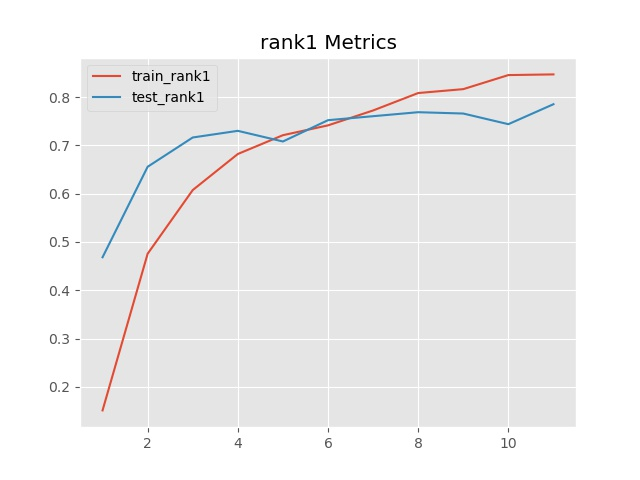

# Pytorch model building tools

### introduction
This tool can quickly build models, fine tune, output graphs, excel, models and so on.

**usage：** `Image Classification`

### environment
```
Pytorch 1.0
cuda 10
Python 3.6
```
### How to easy use?

1.  get a model, you can make one or copy one, and replace classifier. such as:
```python
import torch.nn as nn
from torchvision.models import resnet34
model = resnet34(pretrained=True)
model.fc = nn.Sequential(
    nn.Dropout(),
    nn.Linear(512, 87, bias=False),
)
```

2.  Load model into my tool class(ModelUtils)
```python
from utils import ModelUtils
from demo.gemstones_dataset import train_dataloader, test_dataloader
utils = ModelUtils().build(model).compose(lr=1e-3)
utils.open_checkpoint_output_image(out_dir="./out/resnet/").open_checkpoint(only_best=True)
utils.train(epochs=20, train_dataloader=train_dataloader, test_dataloader=test_dataloader)
```

3.  run this python 
``` console
training epoch[0]: 100%|██████████| 179/179 [00:20<00:00,  8.83it/s, train_all_loss=3.65, train_loss=2.28, train_rank1=0.184, train_rank5=0.392]
evaluate epoch[0]: 100%|██████████| 23/23 [00:01<00:00, 13.86it/s, test_all_loss=2.05, test_loss=2.3, test_rank1=0.512, test_rank5=0.837]
[info]正在保存模型...
[info]正在输出相关指标变化图...
training epoch[1]: 100%|██████████| 179/179 [00:17<00:00, 10.01it/s, train_all_loss=1.88, train_loss=2.91, train_rank1=0.501, train_rank5=0.846]
evaluate epoch[1]: 100%|██████████| 23/23 [00:01<00:00, 14.06it/s, test_all_loss=1.17, test_loss=1.37, test_rank1=0.631, test_rank5=0.948]
```

### A Sample, 87 classes gemstones classfication
Already dowmload dataset in ```dataset/Gemstones.7z```, and you need to unzip

#### MyDataset
if your dataset like this:
```
dataset_name
   ├─test
   │  ├─ class 1
   │  ├─ class 2
   │  ├─ ...
   │
   └─train
      ├─ class 1
      ├─ class 2
      ├─ ...
```
you only need to modify **data_path** in ```demo/gemstones_dataset.py```

#### Use resnet34 model to classify Gemstones
**example file** in ```demo/resnet_demo1.py```,
**you only need to click running this file** and you can understand How to use this.


### How to use ModelUtils?
ModelUtils is developed based on Pytorch Model.

Part of my approach to ModelUtils implementation uses the same **chained programming** as ```jQuery```

#### Get Model
So,you first need to get model object.

For simplicity, I simply grab the already defined model.

```python
from torchvision.models import resnet34
model = resnet34(pretrained=True)
```

#### Using ModelUtils load the model and initialize it
Get ModelUtils object, and use build() method, 
build() first parameter need a pytorch model(nn.module)
```python
from utils import ModelUtils
utils = ModelUtils().build(model)
```
Now the model has been transferred to CUDA, if you have a CUDA.

#### Setting Training Parameters
compose have 
```python
utils.compose(lr=1e-3)
```
The compose method has a number of parameters that can be passed to the `optimizer`, `scheduler`, 
`loss function`, etc. 

If this is two classes classfication task, you can open `is_two_category=True`.
Will output automatically `Recall`, `Specificity` and `F1-score` etc.

Even you can turn on semi-precision training ,use `is_half=True`.

for example:
```python
optimizer = torch.optim.RMSprop(model.parameters(), lr=1e-5)
scheduler = torch.optim.lr_scheduler.ExponentialLR(optimizer, gamma=0.95)
utils = ModelUtils().build(model).compose(optimizer=optimizer, scheduler=scheduler,is_two_category=True)
```

but you can also **choose to set nothing at all**. 

The default for the loss function is `CrosSentroPyLoss`, 
and the default for the optimizer is `SGD`. 
Learning Rate Decay Default `ExponentiAllr (Optimizer, Gamma =0.99)`

#### Set up automatic output model, automatic output loss accuracy, etc
If you want to train the output model one at a time, the open_checkpoint method does not require any parameters
```python
utils.open_checkpoint_output_image(out_dir="./out/resnet/").open_checkpoint(only_best=True)
```
**output image such as below image:**


#### output trained excel
When you are done, you can use the method to output the Excel table
```python
utils.output_trained_excel()
```

#### training
A DataSet must conform to the Python specification and return a  tuple(image, label), 
for example:```demo/gemstones_dataset.py```

```python
utils.train(epochs=10, train_dataloader=train_dataloader, test_dataloader=test_dataloader)
```

**NOTE:** If the model adds softmax at the end, 
change `is_softmax = True` and do not use the cross-entropy cost function


